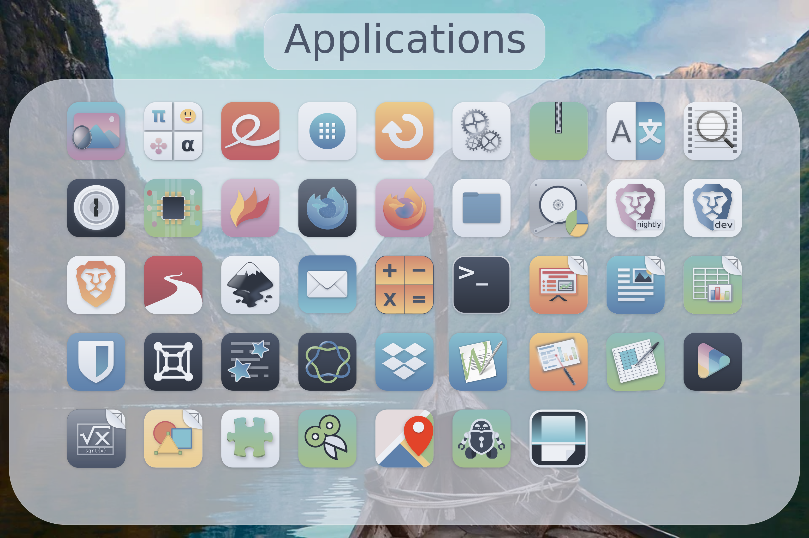
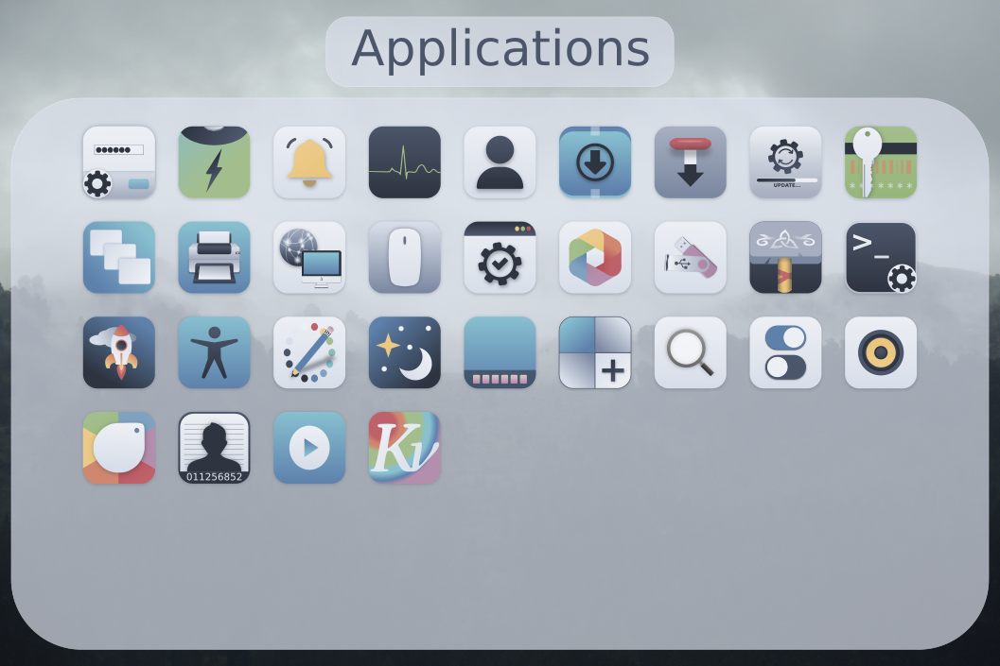

 Nordzy Icon Theme
======

<p align="center">


</p>

Nordzy is a free and open source  icon theme for Linux desktops using the [Nord](https://github.com/arcticicestudio/nord) color palette from [Arctic Ice Studio](https://github.com/arcticicestudio) and based on [WhiteSur Icon Theme](https://github.com/vinceliuice/WhiteSur-icon-theme) and [Numix Icon Theme](https://github.com/numixproject/numix-icon-theme)<br/>
Currently there is not that much icons, I'll take requests for which app icons I should put in next. If I get no requests I take (almost) randomly from the long list of apps. <br/>

## Preview





## Installation
### Installer

To install the icon theme, first clone this repository
```
git clone https://github.com/alvatip/Nordzy-icon
```
Then go inside it
```
cd Nordzy-icon/
```
and use the installer script (with or without arguments). </br>
For a local installation: 
```
./install.sh
```
For a global installation:
```
sudo ./install.sh
```


Usage:  `./install.sh`  **[OPTIONS...]**

|  OPTIONS:           | |
|:--------------------|:-------------|
|-d, --dest  DIR         | Specify theme destination directory (Default: $HOME/.icons)|
|-n, --name  NAME  | Specify theme name (Default: Nordzy)|
|-t, --theme VARIANT | Specify theme color variant(s) (default; purple; pink; red; orange; yellow; green; turquoise; cyan; all)
|-h, --help                 | Show  help|
## Uninstallation
To remove the icon theme, 
If you installed it locally:
```
rm -r $HOME/.local/share/icons/Nordzy*
```
and to remove global installation:
```
sudo rm -r /usr/share/icons/Nordzy*
```

## Other ressources

[Nordzy-cursors](https://github.com/alvatip/Nordzy-cursors) cursors theme. </br> 
[Nordic](https://github.com/EliverLara/Nordic) theme.


## Icon request

When submitting an icon request, please give the following information: <br/>
* Application name
* Icon name if you know it
* Original icon image
* Use tray? Tray icon name (again, if you know it).
* Small description and/or a link to the official webpage.

## Contributing

Help is always welcome.

* Create a new icon for missing applications
* Make a symlink to an existing icon
* Edit an existing icon
* Script improvement
* Spelling, grammar, ...
* ...


## License

GNU General Public License v3.0.
