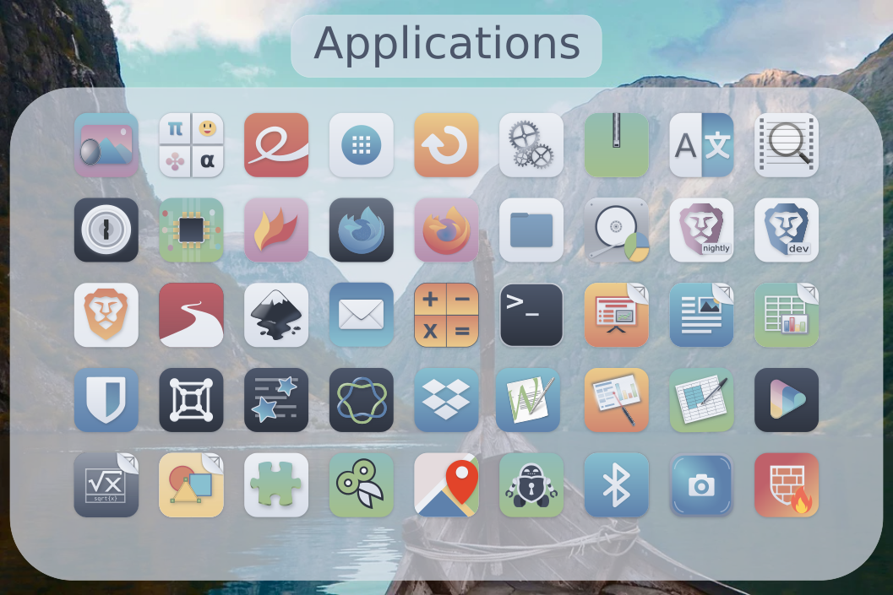
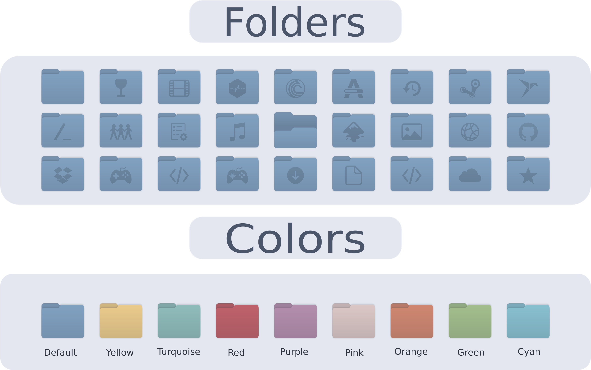

 Nordzy Icon Theme
======

<p align="center">


</p>

Nordzy is a free and open source  icon theme for Linux desktops using the [Nord](https://github.com/arcticicestudio/nord) color palette from [Arctic Ice Studio](https://github.com/arcticicestudio) and based on [WhiteSur Icon Theme](https://github.com/vinceliuice/WhiteSur-icon-theme) and [Numix Icon Theme](https://github.com/numixproject/numix-icon-theme)<br/>
 I’ll take requests for which app icons I should put in next. If I get no requests, I take (almost) randomly from the long list of apps.
Dark variants are more appropriate for dark desktop environments, while the normal variants are more appropriate for light desktop environments. <br/> If you are using a dark theme with a light panel (or the opposite) you can specify the panel argument which make the panel's color opposite.

## Table of contents

- [Preview](#preview)
- [Installation](#installation)
- [Uninstallation](#uninstallation)
- [Creating icons](https://github.com/alvatip/Nordzy-icon/tree/main/tools#creating-icons)
- [Other ressources](#other-ressources)
- [Contributing](#contributing)
- [Icon request](#icon-request)
- [Support the author](#support-the-author)
- [License](#license)


## Preview





## Installation
### Installer

To install the icon theme, first clone this repository
```
git clone https://github.com/alvatip/Nordzy-icon
```
Then go inside it
```
cd Nordzy-icon/
```
and use the installer script (with or without arguments). </br>
For a local installation: 
```
./install.sh
```
For a global installation:
```
sudo ./install.sh
```


Usage:  `./install.sh`  **[OPTIONS...]**

|  OPTIONS:           | |
|:--------------------|:-------------|
|-d, --dest  DIR         | Specify theme destination directory (Default: $HOME/.icons)|
|-n, --name  NAME  | Specify theme name (Default: Nordzy)|
|-t, --theme VARIANT | Specify theme color variant(s) (default; purple; pink; red; orange; yellow; green; turquoise; cyan; all)|
|-c, --color VARIANT| Specify color variant(s) [standard;light;dark] (Default: All variants)|
|-p, --panel|Make panel's color opposite to the color variant of the theme (Default: same as color variant)|
|--total	|Install all theme, color and panel variants|
|-h, --help                 | Show  help|

### tar.gz file
Alternatively, you can use the tar.gz files located in the release section and extract them to the adequate directory.</br>
> Usually `$HOME/.local/share/icons/` for a user installation and `/usr/share/icons/` for a system wide installation.
### Also available
<p align="left">
  <a href="https://www.pling.com/p/1686927" >
    
  </a>
  <a href="https://aur.archlinux.org/packages/nordzy-icon-theme-git" >
    
  </a>
  <a href="https://copr.fedorainfracloud.org/coprs/alvatip/Nordzy-icon/" >
    
  </a>
</p> 


## Uninstallation
To remove the icon theme, 
If you installed it locally:
```
rm -r $HOME/.local/share/icons/Nordzy*
```
and to remove global installation:
```
sudo rm -r /usr/share/icons/Nordzy*
```

## Other ressources

[Nordzy-cursors](https://github.com/alvatip/Nordzy-cursors) cursors theme. </br> 
[Nordic](https://github.com/EliverLara/Nordic) theme.
[Firefox theme](https://addons.mozilla.org/en-US/firefox/addon/nordzy-dark/)

## Icon request

When submitting an icon request, please give the following information: <br/>
* Application name
* Icon name if you know it
* Original icon image
* Use tray? Tray icon name (again, if you know it).
* Small description and/or a link to the official webpage.

## Contributing

Help is always welcome.

* Create a new icon for missing applications
* Make a symlink to an existing icon
* Edit an existing icon
* Script improvement
* Spelling, grammar, etc.

## Support the author

<p align="left">
 <a href="https://www.buymeacoffee.com/alvatips" >
    
  </a>
</p>


## License

GNU General Public License v3.0.
